<h1 align="center">👋👽🐸😎💻</h1>
<!-- 백준(solved.ac) 스탯  -->

    

<h3>🪪 누구세요? 🪪</h3>

    저는 개발자 <code>이현령</code>이라고 합니다. 넷상에서는 주로 <code>zer0ken</code>이라는 아이디로 활동하고 있습니다. 

<h3> 🏠 소속 🏠</h3>

    대전대신고등학교 개발자 동아리 A.C.T, 2016 ~ 2018 🏫 
    온라인 커뮤니티 슈텔로, 2018 ~ 2022 🙌 
    건국대학교 소프트웨어학과, 2019 ~ 2024 🎓 
    Microsoft AI School 6기, 2024 ~ ... 🔍 

    <picture>
        
    </picture>

     

<h3>🚀 프로젝트 🚀</h3>

<picture>
    
</picture>
<picture>
    
</picture>
<picture>
    
</picture>

<h3>❄️ 주로 사용하지 않는 기술 ❄️</h3>

     
     
     

