저는 개발자 `이현령`입니다.   
넷상에서는 주로 `zer0ken`이라는 아이디로 활동하고 있습니다.

🏫 [대전대신고등학교 개발자 동아리 A.C.T](https://youtu.be/a23ONRAhz7Y), 2016 ~ 2018  
🙌 [온라인 커뮤니티 슈텔로](https://sites.google.com/view/shtelo), 2018 ~ 2022  
🎓 [건국대학교 소프트웨어학과](https://cse.konkuk.ac.kr), 2019 ~ 2024  
🔍 [Microsoft AI School 6기](https://youtu.be/60C_z1vTmn8), 2024 ~ ...  

--- 
<!-- 깃허브 Metrics, 우측 정렬 -->

<!-- 기술 스택 / 백준(solved.ac) 스탯 / 프로젝트 -->

  

<!-- 좌우 정렬 초기화 -->

🛠️ 기술 스택 🛠️

### 🔥 주로 사용하는 기술 🔥
 

### ❄️ 요즘 사용하지 않는 기술 ❄️
  
  

### ❓ 찍먹한 적이 있는 기술 ❓
  
  

---

