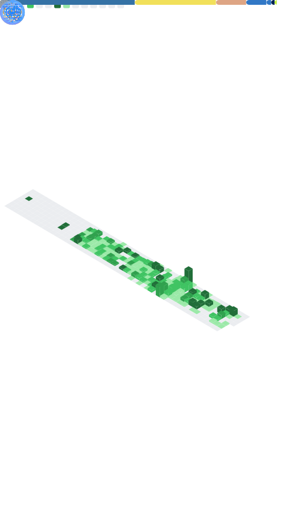

<!-- 깃허브 Metrics, 우측 정렬 -->

# 이현령

> 저는 이현령입니다.

**이현령**은 AI 기반 서비스, RAG 시스템, 문제 해결에 관심을 두고 활동하는 개발자이다. 중학교 시절 C 언어를 접하며 프로그래밍을 시작했고, 대전대신고등학교 개발자 동아리 A.C.T와 건국대학교 컴퓨터공학과를 거쳐 Microsoft AI School에서 AI 서비스 개발 프로젝트를 수행했다. 2025년부터 GraphAI에서 AI를 위한 복합 DB와 RAG 시스템을 개발하고 있다.

## 목차

- [개요](#개요)
- [기본 정보](#기본-정보)
- [관심 분야](#관심-분야)
- [연표](#연표)
- [주요 프로젝트](#주요-프로젝트)
- [그 밖의 활동](#그-밖의-활동)
- [문제 해결](#문제-해결)

## 개요

| 항목 | 내용 |
| --- | --- |
| 이름 | 이현령 |
| 영문명 | Lee Hyeonryeong |
| 출생 | 2000년 11월 5일, 대한민국 대전 |
| 주 활동 지역 | 대한민국 대전 |
| 주력 언어 | Python |
| 주요 분야 | AI 기반 서비스, RAG, 문제 해결 |
| GitHub | [github.com/zer0ken](https://github.com/zer0ken) |

## 기본 정보

이현령은 프로그래밍 언어와 AI 기반 서비스 개발에 관심을 가지고 있으며, 커뮤니티 운영과 문제 해결 활동을 통해 학습과 협업 경험을 쌓았다. Python을 주력 언어로 사용하며, LLM 기반 애플리케이션과 영상 처리 시스템을 중심으로 프로젝트를 수행했다.

## 관심 분야

- **인공지능 기반 서비스 개발**: LLM, RAG, 에이전트 구조를 활용한 서비스 구현
- **컴퓨터 비전**: 객체 탐지, 이미지 분류, 행동 분석 모델 개발
- **프로그래밍 언어**: Python을 중심으로 한 언어 학습과 활용
- **문제 해결**: 온라인 저지와 스터디를 통한 알고리즘 및 자료구조 학습
- **커뮤니티**: 학습 공동체와 온라인 커뮤니티 운영

## 연표

| 기간 | 내용 |
| --- | --- |
| 2016년 이전 | 초등학교 방과후 활동에서 로봇 제작을 경험하고, 중학교 시절 C 언어 학습을 시작했다. |
| 2016 - 2018 | 대전대신고등학교에 재학하며 개발자 동아리 **A.C.T**에서 활동했다. |
| 2018 - 2022 | 온라인 커뮤니티 **슈텔로**에서 운영 및 관리자로 활동했다. |
| 2019 - 2024 | 건국대학교 공과대학 소프트웨어학과에 입학하고 컴퓨터공학과를 졸업했다. |
| 2024 - 2025 | **Microsoft AI School** 6기를 수료했다. |
| 2025 - 현재 | **GraphAI**에서 AI를 위한 복합 DB와 RAG 시스템을 개발하고 있다. |

## 주요 프로젝트

### 인공지능 기반 맞춤형 취업 가이드

2025 · Microsoft AI School

- 저장소: [hire-me-asap/hire-me-app](https://github.com/hire-me-asap/hire-me-app)
- 9인 팀에서 PM으로 참여했다.
- LLM 기반 대화형 RAG 에이전트를 구현했다.
- 채용 공고 데이터를 수집하고 가공하여 Retrieval을 위한 벡터 저장소를 구축했다.
- 청크 분할 전략을 조정하여 RAG 품질을 개선했다.
- Multi-Agent 구조로 기존 기능을 연결하고 사용성을 개선했다.

### 인공지능 기반 반려동물 행동 분석 앱

2025 · Microsoft AI School

- 저장소: [8ollow-me/rogun-app](https://github.com/8ollow-me/rogun-app)
- 7인 팀에서 PL 및 PM으로 참여했다.
- 실시간 영상 처리 기반 객체 탐지와 행동 분류 시스템을 개발했다.
- 반려동물 행동 라벨링 데이터셋을 정제하고 ResNet 모델을 학습했다.
- Optuna를 사용해 파인 튜닝 과정을 개선했다.

### 맞춤 의료 정보 관리 앱

2024 · 건국대학교

- 저장소: [zer0ken/doc-di-ai-server](https://github.com/zer0ken/doc-di-ai-server)
- 4인 팀에서 인공지능 파트를 담당했다.
- 객체 탐지와 인식을 결합한 영상 처리 시스템을 개발했다.
- LLM 기반 챗봇을 개발했다.

### 마이크로디그리 인증 자동화 시스템

2024 · 실감미디어 혁신융합대학 사업단

- 저장소: [zer0ken/degree-verifier](https://github.com/zer0ken/degree-verifier)
- 2인 팀으로 작업했다.
- 클라이언트와 직접 소통하며 요구사항을 분석하고 문서화했다.
- 복잡한 조건을 가지는 마이크로디그리 검사 시스템을 개발했다.
- 8개 대학에서 수집한 3,000여 명의 학생 이수내역을 처리했다.
- 개발된 시스템을 문서화하여 사업단에 인계했다.

## 그 밖의 활동

### 파이썬 PS 스터디 운영

2025 · Microsoft AI School

- 교육생 간 지식 격차를 줄이기 위해 스터디를 운영했다.
- 구성원들이 문제 해결을 통해 Python을 학습하도록 지원했다.

### 온라인 커뮤니티 슈텔로

2018 - 2022

- Discord 기반 친목 커뮤니티에서 운영 및 관리자로 활동했다.
- 커뮤니티 운영 보조와 오락 기능을 제공하는 봇을 개발했다.
- discord.py 문서를 기반으로 API 프로그래밍을 학습했다.

### 대전대신고등학교 개발자 동아리 A.C.T

2016 - 2018

- 공동 부장으로 활동했다.
- 해커톤을 기획하고 주최했다.
- 해커톤을 동아리 연례 행사로 정착시켰다.

## 문제 해결

- 백준 온라인 저지와 프로그래머스를 통해 문제 해결을 공부하고 있다.
- Python, 자료구조, 알고리즘을 중심으로 학습하고 있다.
