### 🪪 누구세요? 🪪
저는 개발자 `이현령`이라고 합니다. 넷상에서는 주로 `zer0ken`이라는 아이디로 활동하고 있습니다.

### 🏠 소속 🏠
🏫 대전대신고등학교 개발자 동아리 A.C.T, 2016 ~ 2018  
🙌 온라인 커뮤니티 슈텔로, 2018 ~ 2022  
🎓 건국대학교 소프트웨어학과, 2019 ~ 2024  
🔍 Microsoft AI School 6기, 2024 ~ ...  

--- 
<!-- 깃허브 Metrics -->

<!-- 기술 스택 / 백준(solved.ac) 스탯 / 프로젝트 -->
 

<!-- 좌우 정렬 초기화 -->

### ❄️ 찍먹했거나 요즘 사용하지 않는 기술 ❄️

---

